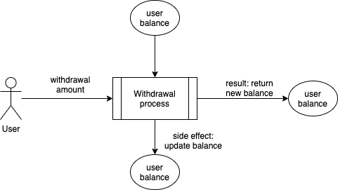
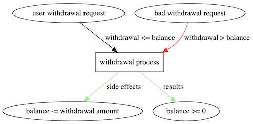
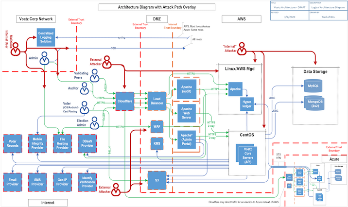
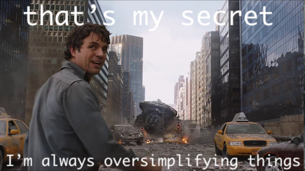

# Sister Loji's Modeling School for Wayward InfoSec Youth
## meditations on applying various infosec models
### and giving your best blue steel

_16DEC2020, Mid-Winter's Night Con_

---

# Take aways

1. this talk focuses on four domains we can model (risk, threat, maturity, and (semi-)formal)
1. from a  data-centered, control-centered position
1. with a focus on practical techniques
1. in a simple code style that could be used for a reasoning system
1. _(bonus 🌶 takeway)_ we need to stop being afraid of DSLs and models for our own thinking purposes
    - definitely former Lisper-thinking

---

# _do you or someone you know suffer from the following:_

- inability to understand your infosec programs?
- anxiety or concern about the state of your systems?
- feels of despair or loss of control as to where your data ends up?

> Sister Loji's Modeling School for Wayward InfoSec Youth is an absurdist-focused 
> school meant to help youth  from all walks of life better model & understand their
> infosec programs

---

# outline

1. take aways
1. advert
1. intros
1. what is modeling?
1. why model?
1. what are we modeling?
   1. practical techniques for the wayward youth
   1. risk
   1. threat
   1. maturity
   1. (semi-)formal
1. what do we get out of modeling?
1. Lifting vs Extraction
1. Application

---

# `$ finger lojikil`

```
[lojikil.com]
Stefan Edwards (lojikil) is not presently logged in.

- Practice Lead at Trail of Bits
- Twitter/Github/Lobste.rs: lojikil
- Works in: Defense, FinTech, Blockchain, IoT, compilers,
vCISO services, threat modeling
- Previous: net, web, adversary sim, &c. 
- Infosec philosopher, programming 
language theorist, everyday agronomer, father.
- As heard on Absolute AppSec (multiple) and Risky
Business (No. 559).

WARNING: DEAF
WARNING: Noo Yawk
```

---

# Trail of Bits

- large number of smart contract assessments (5-10 *per month*)
- large number of bespoke blockchain assessments (~ 5 *per year*)
- work in large code bases like Kubernetes, etcd, &c.
- work in fundamental program analysis research for DARPA
- work on tools like Manticore (symbex), Echidna (property testing), Slither (static analysis & absint)
- surrounding areas: cryptography, infra, &c

_publications: github.com/trailofbits/publications_

---

# background

- this talk uses carML, a programming language I wrote
  - Yeti + StandardML + OCaml + F# + Scala + Scheme + Sadness
  - github.com/lojikil/carML
- we will only use four notations:
  - `type`, which introduces sum types/variants/tagged unions/case classes
  - constructors for `type`, which introduce each of the variants/cases
  - `record`, which introduces product types/structs/classes
  - `def`, which defines a function
- can compile these to C or Go as needed, right now
- point: my exploration for what a framework would look like
  - need data ingestion
  - most of this code would be _produced_ by other tools

---

# what is modeling?

I like [Wikipedia's](https://en.wikipedia.org/wiki/Modeling_language) definition:

> A modeling language is any artificial language that can be used to express information
> or knowledge or systems in a structure that is defined by a consistent set of rules.
> **The rules are used for interpretation of the meaning of components in the structure.**

- basically, break down things in a consistent way
- express information in a consistent fashion
- to help us understand meaning

---

# what is modeling?

<!--
so really we do this all the time...
-->

- we make models all the time
- drawings
- data flows
- simple comments
- this talk is meant  to  help _formalize_ those
- take you from this: `NOTE: balance should be great than withdrawl before execution`
- to this:

```
// @assignable balance
// @requires balance >= 100
// @requires withdrawal <= balance
// @ensures balance == \old(balance) - withdrawal
```

---

# why model?

- let's look at that example
- original: `NOTE: balance should be great than withdrawl before execution`
    1. mispelt "withdrawal?" "greater than?"
    1. what does "should be mean?"
    1. what's the result of all of this?
- new:
    1. the system checks our spelling
    1. we know that `balance` is modified
    1. we know that balance must be greater than or equal to 100
    1. we know that the withdrawal amount must be less than or equal to the balance
    1. and we know the result is equal to the original balance less the withdrawal
    1. all enforced by our modeling language
- result: better design, more understanding

---

# why model?

<!--
I think very often we get stuck on what "modeling" actually means; we want some sort
of output from modeling, not really realizing that models are just code/data that we
can further manipulate to our needs 
-->

- there are infinite output types
  - process diagrams
  - simple box visualizations
  - user process diagrams
  - code extraction
  - assertions
- work with your teams & orgs to best fit what you need to use
- models, esp models as code, should be updated, manipulated, re-run with new constraints
  - stop thinking in terms of model car
  - start thinking in terms of simulation & modeling

---

# why model?

.left[]
.right[]

---

# why model?

<!--

This was a huge system with numerous components, but the other interesting thing was that 
sitting down and modeling the data flow really helped with the general understanding of
the  system for everyone involved. We then used this to drive where our risks were

-->



---

# why model?

- honestly? a secret: bang for buck, threat modeling often finds more bugs than risk modeling in terms of effort
- folks reconsider designs, choices, and so on just by talking it out
- in terms of density, 8-10 findings falling out from a 30-60 minute call isn't unusual
- simplifies down the system under test
- model our thoughts there



---

# what are we modeling?

## four things we should model (in decreasing order)

- risk: a measure of impact ([ala NIST's definition](https://csrc.nist.gov/glossary/term/risk))
  - likelihood x impact = system severity
  - system severity x importance of data = organizantional severity
  - tied to things like reputation, financial loss, regulatory loss, &c
  - see NIST 800-30, 37, 39, ISO 27k1, &c.
- threat: the potential for impact ([again via NIST](https://csrc.nist.gov/glossary/term/threat))
  - what can an actor do with your system?
  - what controls are in place to stop that?
  - what data do they have access to?
- maturity: the robustness of processes & controls
  - how robust are the tools and processes the team uses?
  - where are they located?
  - how documented are they?
  - see NIST CSF, PRISMA, &c.
- (semi-)formal: mathematical/logical models of processes of a system's flow
  - way too many things for one talk
  - we'll focus on design by contract
- often, we're missing all but the first (and sometimes the first)

---

# what are we modeling? practical techniques for the wayward youth

- **how** you model is just as important as **what** you model?
- we need to kill off "dead" models eventually:
  - solely write-once Visio Diagrams (sorry Brian) 
  - JML that is run once and never kept up to date
  - excel sheets that just capture risks/threats and have no basis in futher reality
- we need to move towards "living" models
  - analyze them like data models
  - yes you should be looking at your data models more frequently
  - why are you all laughing?

---

# what are we modeling? practical techniques for the wayward youth

### we neeed to move towards living models

- [Hilel Wayne has done great work on modeling adversaries with TLA+](https://www.hillelwayne.com/post/adversaries/)
- [Tamarin, a cryptographic proof system, allows users to model key compromise](https://tamarin-prover.github.io/manual/book/003_example.html)
- [RedShiftZero has worked on automatic threat modeling in  a continuous fashion](https://www.redshiftzero.com/continuous-threat-modeling/)
- [PyTM](https://github.com/izar/pytm) is a threat modeling framework, which [I've use to wrestle with complex architectures like k8s](https://github.com/trailofbits/audit-kubernetes/blob/master/notes/stefan.edwards/tm/dataflow/tm.py) 
- In all of these cases:
  - define a model
  - wrestle with implications
  - refine our models through testing

---

# what are we modeling? practical techniques for the wayward youth

- can we do better?
- I think Tamarin has the right idea
  - idealized crypto systems
  - concerned about usage & placement
  - model checks show misusage of keys/crypto systems
- Apply this idea to larger infosec
- in a DSL

---

# what are we modeling? practical techniques for the wayward youth

- obviously YMMV
  - need to model something lower level
  - need to model something in the same system that is non-idealized
- use abstraction power
  - give people general primitives they can work with
  - build off of those 
  - offer decent abstractions
- trying a SWAG at one here
  - because why not?
  - I think about this often

---

# what are we modeling? risk

- let's look at risk
- probably the thing the most of us look at
- what do we have:
  - impact
  - likelihood
  - severity = impact x likelihood
  - source?
  - data?

```
type Data {
    # ...
}

type Component {
    # ...
}

record Risk {
    impact:int
    likelihood:int
    source:Component
    target:Component
    exposed: Data
    short-description:string
    description:string
}
```

---

# what are we modeling? risk

- for simple things, fine
- we can easily define an API
- graphing 
    - `def graph-risk risks:array[Risk] => GraphViz = ...`
    - `def graph-systems risks:array[Risk] => GraphViz = ...`
- reporting
    - `def risks->csv risks:array[Risk] => array[string] = ...`
    - `def risks->html risks:array[Risk] => HTML = ...`
- searching/stacking/grouping
    - `def find-risk risks:array[Risk] ... => Risk = ...`
    - `def stack-risks-by-system risks:array[Risk] ... => ...`
- but can we do better?
    - `impact` is manual, as is `likelihood`
    - disconnected from `Data`
    - what even *is*  `impact`? reputation? money? what?

---

# what are we modeling? risk

- few different directions
- `def calculate-impact reputation:int confidentiality:int integrity:int availability:int ... => int`
- denser:

```
type Impact {
    Very-Low
    Low
    Medium
    High
    Very-High
}

def calculate-impact reputation:Impact ... => Impact
```

- but can we do **even better**?
- Let's look at `Data`

---

# what are we modeling? risk

- what could we encode here?
  - is the data regulated?
  - is the data Confidential/Restricted?
  - is there a subscription restriction (e.g. TLP)?
- encoding other information into `Data`, then offload 
- the ergonomics of our model matter
  - assumptions about what `impact` mean
  - ease of understanding & calculation

```
type Data {
    # ...
    PublicData ...
    ConfidentialData ...
    RestrictedData ...
    SPIIData ...
}

type Actor {
    # ...
}

def  calculate-impact impacted-data:Data  actor:Actor  ...  => Impact = {
    # ...
}
```

---

# what are we modeling? risk

### an alternate direction

- don't be afraid to enrich/contextualize data later
- witness:

```
# an uncontextualized risk

record SimpleRisk {
    impact:int
    likelihood:int
    source:Component
    target:Component
    exposed: Data
    short-description:string
    description:string
}

type ContextualizedRisk {
    SPIIRisk SimpleRisk Actor
    ConfidentialRisk SimpleRisk Actor
    # ...
}
```

- choose what works best for your:
  1. workflows
  1. introspection
  1. tinkering

---

# what are we modeling? risk

### take aways, or, what in the actual fuck, loji?

1. there are multiple paths forward for creating expressive models of risk
1. we can make ergonomic choices about our data & enrich them deeply
1. experimenting with and finding simple encoding mechanisms for our InfoSec programs
   - we worked on `Data`, but `Component` level would work just as well

---

# what are we modeling? threat

- let's take a step down the commonality chart
- we want to capture the _potential_ for impact to a system
- in the section on risk, we defined:
  - `Data`
  - `Component`
  - `Impact`
- what of those can we reuse to describe potential risk

---

# what are we modeling? threat

- most of what I do for these is talk
  - what does this component talk to?
  - what data does it store?
  - where does it store it?
  - how does it talk to other components?
  - who has access to it?
- a large part of what we do is reverse [Architectural Decisions (ADs)](https://adr.github.io/) and find gaps
- outputs?
  - new architectural decision records
  - new arcitecture diagrams
  - new new relationship flows
  - documenting component relationships
  - documenting gaps

---

# what are we modeling? threat

```
record SimpleThreat {
    system-impact:Impact
    organization-impact:Impact
    discovery-likelihood:Likelihood
    exploitation-likelihood:Likelihood
    source:Component
    target:Component
    exposed:Data
    short-description:string
    description:string
}
```

- all told, not that dissimilar from `Risk`
  - some lessons learnt on `Impact` 
  - similar for `Likelihood`
  - some minor addendums such as "likelihood of discovery"
  - but fairly similar
- again, fine for simple threats
  - source, sink what data

---

# what are we modeling? threat

- in threat models, we mostly organize by component
  - and often by control family
- we also need to capture  mitigations, remediations...
- let's flip this:

```
type Mitigation {
    # ...
}

type Remediation {
    # ...
}

type Threat {
    MitigatedThreat Mitigation SimpleThreat
    RemediatedThreat Remediation SimpleThreat
    UnmanagedThreat SimpleThreat
}
```

- we can normalize this of course
  - mo efficiency, mo space
- but generally, captures the controls/mitigations/remediations we'd need
- can graph/report/respond/further model out of here

---

# what are we modeling? maturity

- let's keep this ball rolling, maturity
- maturity is a (qualitative) measure of processes
- many, many different models here:
  - OWASP SAMM
  - bSIMM
  - PRISMA
  - ...
- I'd like to focus on two maturity models:
  - Program Review for Information Security Assistance (PRISMA)
  - Hunt Maturity Model (HMM)
- And design our own

---

# what are we modeling? maturity

- [PRISMA defines 5 maturity levels](https://csrc.nist.gov/Projects/Program-Review-for-Information-Security-Assistance/Security-Maturity-Levels)
- [Hunt Maturity Model does as well](https://medium.com/@sqrrldata/the-cyber-hunting-maturity-model-6d506faa8ad5)
- what we model for in maturity depends on where we sit in an org
- me? I often need to model control, mitigation, remediation, &c. robustness
- let's look at that

```
type Control {
    # ...
}

type Mitigation {
    # ...
}

type Remediation {
    # ...
}
```

---

# what are we modeling? maturity

- PRISMA and HMM have 5 "levels" of maturity
  - PRISMA: Policies, Procedures, Implementation, Test, Integration 
  - HMM: Initial, Minimal, Procedural, Innovative, Leading
- capture how mature aspects of an organization is
- at ToB, we rate control families on maturity:
  - Strong, Satisfactory, Moderate, Weak, Missing, Not Applicable

```
type Maturity {
    # carML doesn't yet support named constructor parameters
    # but that be a nice additional here, or a `newtype` to
    # rename strings there
    #
    # additionally, there could be some variance here; Satisfactory
    # may be because the control isn't centrally located, or isn't
    # well tested; we might want to add those notions here. Avoid
    # using strings/ints/bools for things we can use the type system
    Strong Control Component string
    Satisfactory Control Component string
    Moderate Control Component string
    Weak Control Component string
    Missing Control Component string
    NotApplicable Control Component string
}
```

- can do this for `Remediation` and `Mitigation` as well
- can start to measure which components are weak, why, where, &c

---

# an aside: maturity vs posture

- most people run into this
- maturity != posture
- posture: a measure of how strong the app's defenses are
- maturity: a measure of how well defined & robust those defenses are
  - a candidate recently said "maturity is posture over time" which I think is great
- when you're modeling things, make sure you understand **what** you're modeling

---

# what are we modeling? (semi-)formal/correctness

- there are two directions we can go with this
- originally: I was going to talk about how with this definition tower, you can move many things
    - great paper: [From definitional interpreters to symbolic executors](https://dl.acm.org/doi/10.1145/3358502.3361269)
- but there's a further interesting thought here:
    - we have many primitives here
    - we can certainly query the state of the world for things, and spot bugs
    - for example, connections that shouldn't happen
- let's explore: what would light-weight methods look like for this process?

---

# what are we modeling? (semi-)formal/correctness

<!--

- constraint-based approach
- design by contract 

talk about how we write code that processes the data that is encoded in these models.

like:

```
def foo x:Data y:Data => Result[Data] = {
    when (every (is? x SPIIData) (is? y PublicData)) do {
        Err "cannot mix public and SPII data"
    }
    # ...
}

formal models needn't be _super formal_, and semi-formal models are better than _no models_

```

-->

---

# what do we get?

- unified reporting
- "thinking" language for your work
- a place to explore the implications of changes

of course, it's like Kris Micinski said:

> _eventually, when you code this much in a specification language,_
> _your programming language just becomes the specification language_

- I think that's ok: work with what you need, extract to common languages
  - probably a 🌶 take there

---

# Lifting vs Extraction

---

# Application

---

# Outro
